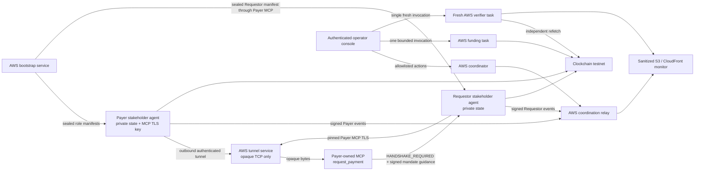

# AWS stakeholder-driven Handshake control-plane design

**Status:** Approved architecture

**Date:** 2026-07-30

**Repository:** `thetangstr/clockchain-handshake`

## 1. Goal

Move every shared Clockchain Handshake demo process off Kailor's Mac and into
AWS while keeping the two commercial parties independently controlled.

The finished demo has these properties:

- A Payer stakeholder and a Requestor stakeholder each start from a fresh local
  agent on macOS, Windows, or Linux.
- Each stakeholder pastes one public prompt and remains attached to one
  long-lived command. No manifest attachment or follow-up prompt is required.
- Payer owns the payment mandate, its private state, its MCP TLS private key,
  and the MCP service that tells Requestor that Clockchain Handshake is
  required.
- Requestor asks Payer's MCP for payment, receives exact
  `HANDSHAKE_REQUIRED`, follows Payer's signed mandate, and never acts as Payer.
- AWS hosts the shared relay, operator coordination, bootstrap approvals,
  funding execution, watcher, fresh verification, and public-monitor
  publication.
- No demo-time process, tunnel, file, keychain entry, or localhost service on
  Kailor's Mac is required.
- A successful run contains exactly three independently re-verifiable
  Clockchain anchors in this order:
  `PROPOSED -> ACCEPTED -> ACKNOWLEDGED`.
- Only a fresh aggregate verifier may emit `AUTHORIZED`.
- Every protocol, result, console, and monitor artifact preserves
  `paymentMoved:false`.

## 2. Scope

### 2.1 In scope

- AWS infrastructure as code for the full shared control plane.
- An AWS-hosted raw-TCP coordination relay.
- An AWS-hosted authenticated reverse-tunnel gateway for Payer's locally owned
  MCP server.
- A one-shot Payer bootstrap wrapper equivalent in usability to the existing
  one-shot Requestor wrapper.
- Operator-authenticated web controls for starting a run, approving exact
  stakeholder claims, initiating the bounded funding batch, and launching the
  fresh verifier.
- Persistent restart-safe control-plane state and funding replay journals.
- Sanitized live and historical public-monitor projections.
- Updated public Payer and Requestor prompts.
- Deterministic tests, AWS integration checks, and one fresh funded physical
  rehearsal with independent Payer and Requestor agents.

### 2.2 Out of scope

- Moving either stakeholder's private keys or private state into AWS.
- Hosting the Payer or Requestor agent itself.
- Mainnet value transfer or payment execution.
- Concurrent active demo sessions. The first AWS release permits exactly one
  active session and retains completed sessions as read-only history.
- Multi-validator or production-grade Clockchain claims.
- A general-purpose mandate marketplace or reusable payment service.
- Agent2Agent (A2A) messaging. MCP remains the Payer-owned payment-intake
  surface; signed relay events and Clockchain receipts remain the protocol and
  authority surfaces.

## 3. Current-state finding

The present deployment is not independent of Kailor's Mac:

- EC2 `i-07f8b33e8658127f3` exposes port `9443`, but the listener is an SSH
  reverse tunnel back to Payer MCP on Kailor's loopback.
- The operator console listens on `127.0.0.1:8787` on Kailor's Mac.
- The public-monitor publisher reads that loopback console and uploads
  `latest.json` to S3 from Kailor's Mac.
- Relay, coordinator, bootstrap broker, funding journal, watcher, and verifier
  state are created under operator-local filesystem roots.
- AWS currently has no ECS cluster, EFS filesystem, or relevant Secrets Manager
  entries for this control plane.

The migration replaces each local shared responsibility directly:

| Current dependency | AWS replacement |
| --- | --- |
| Operator relay process | ECS Fargate relay service behind NLB TCP pass-through |
| Operator coordinator | Per-run ECS Fargate coordinator task |
| Operator bootstrap broker | ECS Fargate bootstrap service plus persistent EFS journal |
| Reverse SSH process on Kailor's Mac | Payer-originated run-scoped outbound reverse tunnel to an AWS tunnel service |
| Operator console | Cognito-authenticated CloudFront web console and control API |
| Funding command and journal | Isolated ECS funding task with EFS replay journal |
| Fresh verifier command | Isolated, single-use ECS verifier task |
| Loopback public-monitor publisher | ECS publisher task writing sanitized S3 objects |
| Local run files | Encrypted EFS session directories with access-point isolation |
| Keychain/operator secrets | Secrets Manager secrets with task-specific IAM access |

## 4. Chosen architecture

The AWS control plane uses these service boundaries:

1. **Amazon ECS on Fargate** runs the long-lived relay, bootstrap service,
   tunnel service, operator runner, and public publisher. Coordinator, funding,
   and verifier jobs run as isolated one-shot tasks.
2. **Network Load Balancer** exposes raw TCP for the coordination relay and the
   Payer tunnel. AWS never terminates Payer MCP TLS.
3. **Amazon EFS** stores encrypted, restart-safe session state, sealed bootstrap
   journals, funding journals, and verifier output. Separate access points and
   task roles restrict each workload to its required paths.
4. **Amazon S3 and CloudFront** publish only signed discovery documents, public
   certificates, current sanitized monitor state, and sanitized historical run
   summaries.
5. **Amazon Cognito, API Gateway, Lambda, and SQS** provide authenticated
   operator controls. The API validates and queues allowlisted actions; it does
   not possess protocol signing or funding keys.
6. **AWS Secrets Manager and KMS** protect the operator Ed25519 private key,
   Clockchain token, relay TLS key, Sepolia RPC URL, treasury keystore and
   password, and tunnel host keys.
7. **CloudWatch** receives redacted service logs, health metrics, task exits,
   and alarms. Secrets, capabilities, launch manifests, live evidence, and
   private filesystem paths are excluded from logs.

The first release uses one desired task for each stateful service and one active
session at a time. ECS restarts failed tasks, while EFS supplies durable state.
This removes the Mac dependency without claiming multi-region or
active-active availability.

Secrets are injected only into the workload that needs them:

| Workload | Permitted application secrets | Explicitly unavailable |
| --- | --- | --- |
| Operator console and control-API Lambda | None | Every protocol, tunnel, Clockchain, and treasury secret |
| Operator runner | Operator Ed25519 key | Treasury material, Clockchain token, relay TLS key, tunnel host key |
| Relay | Relay TLS certificate and private key | Operator key, treasury material, Clockchain token, tunnel host key |
| Bootstrap service | Operator Ed25519 key | Treasury material, Clockchain token, relay TLS key, tunnel host key |
| Coordinator task | Operator Ed25519 key, Clockchain token, RPC URL | Treasury material and tunnel host key |
| Tunnel service | Stable SSH host private key | Operator key, treasury material, Clockchain token, relay TLS key |
| Funding task | Sepolia RPC URL, treasury keystore, treasury password | Operator key, Clockchain token, relay TLS key, tunnel host key |
| Fresh verifier task | Clockchain token and the RPC URL required for independent refetch | Operator key, treasury material, relay TLS key, tunnel host key |
| Public publisher | None; its AWS task role permits only sanitized reads and public-object writes | Every application secret and every raw evidence path |

Each ECS task role may call `secretsmanager:GetSecretValue` only for the entries
listed in its row. The static console, Cognito client, API Gateway, Lambda,
SQS, and public browser never receive a project secret.

## 5. Trust and authority

### 5.1 Role ownership

- Payer alone creates and stores its role key, state root, tunnel key, and MCP
  TLS private key.
- Requestor alone creates and stores its role key and state root.
- AWS stores operator and treasury secrets but never receives either
  stakeholder's private key.
- The tunnel service transports opaque MCP TLS bytes and cannot authoritatively
  change the signed mandate or payment request.

### 5.2 Exact event authority

- Payer alone signs the mandate, `PROPOSED`, and `ACKNOWLEDGED`.
- Requestor alone signs the formal payment request and `ACCEPTED`.
- Operator events remain limited to the existing explicit allowlist.
- Relay fields, SQS messages, console state, watcher output, health checks, and
  public-monitor fields are advisory.
- Every artifact validator continues to require the exact expected signer,
  role, repository SHA, release ID, session ID, digest, ordering, and expiry.

### 5.3 Authorization boundary

The operator runner launches a verifier but cannot manufacture its result. The
fresh verifier:

- starts in a new ECS task with empty ephemeral process state;
- receives read-only access to the completed session evidence;
- receives no Payer key, Requestor key, treasury key, or operator signing key;
- independently refetches and verifies exactly three Clockchain anchors;
- rejects missing, duplicate, reordered, expired, malformed, or mismatched
  evidence; and
- is the only production module permitted to emit `AUTHORIZED`.

The operator console and public monitor display the business label `VERIFIED`;
they do not emit the authorization literal themselves.

## 6. Public discovery and one-shot stakeholder entry

### 6.1 Reviewed release

Each deployment binds an immutable Git commit SHA to:

- the ECR image digest used by AWS tasks;
- the signed Payer bootstrap discovery document;
- the signed Requestor discovery document;
- both sealed launch manifests; and
- all later protocol and verifier artifacts.

Both stakeholder wrappers require a clean detached checkout at that exact SHA
before creating or receiving private material.

### 6.2 Payer public prompt

The public page gives the Payer stakeholder one prompt. The agent:

1. clones or validates the public repository at the signed reviewed SHA;
2. activates Node.js 22 and installs with `npm ci --ignore-scripts`;
3. creates a fresh `0700` Payer state root;
4. runs one Payer bootstrap command with only the public signed bootstrap URL
   and its private state root; and
5. remains attached until the role reaches terminal local status.

The Payer wrapper performs all remaining steps:

1. verifies repository cleanliness, detached HEAD, signed discovery, operator
   key, expiry, and AWS tunnel host-key fingerprint;
2. creates an X25519 bootstrap key, an ephemeral SSH tunnel key, and the Payer
   MCP TLS key and certificate locally;
3. submits only public claim material, including the TLS certificate and its
   fingerprint but never its private key;
4. reports the exact claim fingerprint and polls while operator approval is
   pending;
5. verifies the operator-signed response and decrypts the sealed Payer launch
   manifest locally;
6. starts a restricted outbound reverse SSH tunnel to AWS;
7. starts the Payer MCP and supervisor; and
8. remains attached through local `PROPOSED` and `ACKNOWLEDGED`.

The stakeholder does not attach a manifest, copy a certificate, configure an
AWS account, or paste a second prompt.

The command checks Git, Node.js 22/npm, an OpenSSH client, and OpenSSL before
creating private material. A missing prerequisite fails before claim creation
and the public prompt instructs the stakeholder's local agent to install or
repair it. Browser-only agent products are not supported.

### 6.3 Restricted Payer tunnel

The tunnel service accepts only a public key bound to an approved, unexpired
Payer bootstrap claim. Approval atomically consumes that claim and creates one
run-scoped tunnel grant bound to the exact:

- `releaseId`, `sessionId`, repository SHA, and Payer role;
- claim nonce and claim fingerprint;
- X25519 bootstrap public key;
- SSH public key and fingerprint;
- MCP TLS certificate and fingerprint;
- signed public MCP hostname and port; and
- expiry.

A consumed claim cannot be approved again or used across sessions. One grant
permits exactly one concurrent Payer tunnel. The same key may reconnect after
network or ECS interruption while the same session remains active and the
grant remains unexpired; reconnect does not create a new grant. Terminal
success, terminal failure, operator abort, or expiry revokes the authorized key,
closes the listener, and leaves a durable tombstone that prevents reuse.

SSH authorization permits remote forwarding only to the fixed Payer MCP port.
It prohibits shell, PTY, agent forwarding, X11 forwarding, local forwarding,
user startup files, and additional listen ports.

The tunnel ECS task declares fixed container ports:

- `2222` for its SSH server;
- `9443` for the run-scoped reverse-forward listener; and
- `8080` for a non-authoritative task health endpoint.

The NLB exposes:

- public TCP `443` to target-group/container port `2222`; and
- public TCP `9443` to target-group/container port `9443`.

The Payer SSH client connects to the NLB on `443` and requests the one permitted
remote binding, `0.0.0.0:9443`, inside the tunnel task's network namespace. The
NLB Payer-MCP target group always targets the predeclared fixed port `9443`; it
does not register an arbitrary dynamic port. Its health check uses port `8080`.
Before a valid tunnel binds `9443`, MCP connections fail closed and the monitor
reports unavailable. A single-active-session lock prevents another connection
from replacing the listener.

The NLB performs raw TCP pass-through. Requestor validates the Payer-generated
certificate and fingerprint from the operator-signed discovery document.

### 6.4 Requestor public prompt

The Requestor keeps the existing one-shot model:

1. validate the signed discovery and reviewed release;
2. create a fresh private bootstrap key and claim;
3. call Payer MCP's `/bootstrap` route through the AWS raw-TCP tunnel;
4. wait for exact operator approval of the claim fingerprint;
5. decrypt the sealed Requestor manifest locally;
6. call Payer's `request_payment` tool once;
7. require exact `HANDSHAKE_REQUIRED` with the validated instruction object;
8. start the Requestor supervisor automatically; and
9. remain attached through local `ACCEPTED`.

The MCP response guides the Requestor agent after the initial public prompt.
No A2A protocol or second human message is required.

## 7. Operator control flow

The operator signs in to the AWS-hosted console and performs only the shared
control actions:

1. **Start run** — create one release/session from the reviewed SHA and launch
   relay, coordinator, bootstrap, watcher, and publisher state.
2. **Approve Payer** — compare and approve the exact public claim fingerprint.
3. **Approve Requestor** — compare and approve the exact public claim
   fingerprint after Payer MCP receives the request.
4. **Fund test addresses** — invoke the funding task once after the
   coordinator-owned signed funding record is ready.
5. **Verify** — invoke one fresh aggregate-verifier task after both role-local
   result packages are complete.

Every action includes an idempotency key and expected session revision.
Duplicate, stale, cross-session, or out-of-order actions fail closed. The
console never accepts raw addresses, tokens, manifests, private keys, or
evidence uploads.

The funding task reads the coordinator-owned record directly from EFS and
preserves its journal after any attempt. It verifies:

- exactly four distinct fresh Sepolia addresses;
- exactly `0.01` Sepolia ETH per address;
- the expected chain and treasury address;
- zero recipient nonces before funding;
- sufficient treasury balance;
- an unused session funding journal; and
- confirmed transaction receipts before signaling completion.

These transfers supply test gas and do not represent the demo payment;
`paymentMoved` remains `false`.

## 8. Persistence, restart, and recovery

Each session has an immutable directory rooted by release ID and session ID.
EFS IAM authorization and encryption in transit are mandatory. Every task
mounts only named access points under a fixed POSIX identity; no task mounts the
filesystem root. Access points separate:

| Workload | EFS access |
| --- | --- |
| Relay | Read/write relay state only |
| Operator runner and coordinator | Read/write operator state and exact per-run staging paths |
| Bootstrap service | Read/write bootstrap journal; read-only manifest staging |
| Tunnel service | Read-only approved/tombstoned tunnel grants; write-only bounded health projection |
| Funding task | Read-only signed funding record; read/write immutable funding journal |
| Fresh verifier | Read-only completed evidence plus a distinct read/write verdict output access point |
| Public publisher | Read-only sanitized console and verifier-public projections; no raw evidence access |
| Console/API/Lambda | No EFS mount |

Atomic-write, file-mode, no-symlink, no-hard-link, exact-schema, and replay
checks from the existing implementation remain mandatory.

On ECS restart:

- relay and coordinator replay only authenticated durable events;
- bootstrap services retain claim approval and single-use sealing state;
- funding never retries an attempted journal automatically;
- publisher marks snapshots stale until it can revalidate current state;
- an interrupted verifier result is discarded and a new fresh task must start;
  and
- Payer and Requestor may reconnect only with the same private state and an
  unexpired approved launch.

No recovery path may reduce the protocol state, change a party, replace a
mandate or request, reuse a consumed manifest, or infer authorization from a
previous run.

## 9. Public monitor

The ECS publisher reads the strict sanitized EFS console projection and the
verifier-public projection directly. It does not call the existing
loopback-only console URL and does not probe a Mac-local MCP port.

The publisher produces:

- `latest.json` for the active or most recently completed run;
- one sanitized immutable summary under `runs/<run-id>.json`;
- a bounded run index for the business-friendly history view; and
- signed discovery and public-certificate objects needed by stakeholder
  wrappers.

The live view shows:

- run identifier and freshness;
- Payer, Requestor, relay, MCP, coordinator, funding, and verifier status in
  business language;
- the exact current protocol step;
- Payer `PROPOSED`, Requestor `ACCEPTED`, and Payer `ACKNOWLEDGED`;
- block heights and public explorer links for the three anchors;
- verifier status;
- `paymentMoved:false`; and
- explicit stale, unavailable, failed, or expired states.

The public projection never includes invitations, capabilities, tokens,
private keys, manifests, private paths, raw evidence packages, internal IP
addresses, operator identity tokens, RPC URLs, or treasury data.

A previously green snapshot becomes visibly stale when publication stops. The
page must never preserve a success appearance after `staleAfterMs`.

## 10. Failure behavior

All public and operator APIs return bounded schema-validated status objects.
They do not return stack traces, secret paths, command lines containing private
arguments, or raw child-process output.

The run terminates or remains visibly pending as appropriate when any of these
occurs:

- repository SHA or ECR digest mismatch;
- invalid or expired discovery;
- unapproved or changed claim fingerprint;
- tunnel host-key or MCP TLS fingerprint mismatch;
- missing, duplicate, reordered, or unauthorized relay event;
- altered mandate or payment request;
- bootstrap response replay;
- extra stakeholder session;
- funding record mismatch, recipient nonce mismatch, or funding replay risk;
- Clockchain anchor mismatch or incomplete confirmation;
- verifier task failure or non-fresh evidence;
- stale monitor source; or
- any non-`false` `paymentMoved` value.

Neither role, relay, coordinator, watcher, funding task, operator UI, nor
publisher may convert a failure or pending state into authorization.

## 11. Infrastructure and deployment

Infrastructure lives in a separate repository-local package so participant
runtime dependencies remain minimal. The infrastructure package is
`infra/aws/`, uses AWS CDK v2 with TypeScript, and defines:

- one VPC across at least two Availability Zones;
- public task subnets with security groups that allow ingress only from the
  relevant load balancers and allow required outbound Clockchain/Sepolia access;
- ECS cluster, ECR repositories, task definitions, services, and one-shot task
  roles;
- encrypted EFS and access points;
- NLB listeners and target groups for relay, tunnel, and public Payer MCP TCP;
- Cognito, API Gateway, Lambda, SQS, operator-console S3, and CloudFront;
- public-monitor S3 and CloudFront;
- Secrets Manager entries and least-privilege IAM policies;
- CloudWatch log groups, retention, metrics, dashboards, and alarms; and
- deployment outputs used to build signed discovery documents.

Images are built from the exact reviewed SHA and pushed under immutable tags.
Production task definitions pin ECR image digests, not mutable tags.

The normative implementation surfaces are:

- `bin/handshake-payer-bootstrap.mjs` — the single public Payer command;
- `src/bilateral/local-mcp/payer-bootstrap.mjs` — signed discovery, private
  claim, sealing, TLS, tunnel, and supervisor orchestration;
- `src/bilateral/aws/tunnel-grant.mjs` — exact claim/grant validation,
  consumption, reconnect, revocation, and tombstones;
- `src/bilateral/aws/control-actions.mjs` — authenticated operator action
  schemas, ordering, revisions, and idempotency;
- `scripts/run-aws-operator-worker.mjs` — SQS consumer and task launcher;
- `scripts/publish-aws-public-monitor.mjs` — EFS-to-S3 sanitized publisher;
- `infra/aws/bin/clockchain-handshake.ts` and
  `infra/aws/lib/clockchain-handshake-stack.ts` — CDK application and stack;
- `infra/aws/docker/control-plane.Dockerfile` and
  `infra/aws/docker/tunnel.Dockerfile` — immutable runtime images;
- `infra/aws/lambda/control-api.mjs` — secret-free control API;
- `infra/aws/operator-console/` — Cognito-authenticated static console; and
- focused `test/aws-*.test.mjs` and Payer-bootstrap tests mirroring these
  boundaries.

Pure validation and state-transition logic stays under `src/`; CLI, Lambda, and
container entrypoints remain thin adapters. The implementation plan may split
these files into smaller single-purpose modules but may not merge authority
boundaries or move participant logic into the infrastructure package.

The existing `t4g.nano` port-forwarding instance and every relevant macOS
LaunchAgent are removed from the run path only after AWS acceptance passes.
Deletion of legacy infrastructure is a separate, explicitly reviewed cleanup
step.

## 12. Testing

### 12.1 Deterministic tests

- Payer bootstrap discovery and signature validation.
- Payer claim creation, persistence, approval polling, and sealed-envelope
  decryption.
- Exact SSH public-key and listen-port restrictions.
- Payer wrapper repository and private-state checks.
- Payer MCP TLS certificate/fingerprint binding.
- Requestor bootstrap through the AWS tunnel.
- Operator API authentication, action allowlist, idempotency, order, and
  cross-session rejection.
- Funding task single-shot and replay behavior.
- Verifier task isolation and exact three-anchor enforcement.
- Public snapshot sanitization, freshness, and historical rendering.
- Static checks that production console and publisher modules cannot emit
  `AUTHORIZED`.

### 12.2 Container and AWS integration tests

- Build every image from the frozen SHA.
- Start the full topology with deterministic fake Clockchain and Sepolia
  adapters.
- Kill and restart each long-lived task independently and confirm durable replay.
- Confirm NLB passes Payer MCP TLS without terminating or replacing it.
- Confirm unapproved tunnel keys, extra listen ports, and changed fingerprints
  fail.
- Confirm task roles cannot read unrelated EFS access points or secrets.
- Confirm CloudWatch and public S3 objects contain no canary secrets.

### 12.3 Live acceptance

Use two fresh stakeholder agent contexts and only the public prompts:

1. Payer completes its one-shot bootstrap and reports `PAYER_MCP_READY`.
2. Requestor contacts the public Payer MCP endpoint and visibly receives exact
   `HANDSHAKE_REQUIRED`.
3. No stakeholder receives an attached launch manifest or a second prompt.
4. AWS funds exactly four generated addresses with `0.01` Sepolia ETH each.
5. Payer anchors `PROPOSED`.
6. Requestor anchors `ACCEPTED`.
7. Payer anchors `ACKNOWLEDGED`.
8. A new verifier task independently refetches exactly those three anchors and
   alone emits `AUTHORIZED`.
9. The public monitor shows the corresponding verified business outcome and
   `paymentMoved:false`.
10. Stop the old Mac console, publisher, and reverse tunnel and repeat public
    endpoint health checks. Payer MCP, discovery, operator controls, monitor,
    and historical results remain available.

The final acceptance record must also include:

- evidence that the old reverse-tunnel EC2 instance is stopped or that its
  public relay ingress is closed;
- an empty process check for the old Mac reverse SSH command,
  `publish-public-monitor.mjs`, and `handshake-console.mjs`;
- disabled or unloaded status for their macOS LaunchAgent labels;
- a Payer-MCP TLS request from a network other than Kailor's Mac;
- public `latest.json` updates spanning at least two `staleAfterMs` windows
  while the Mac processes remain stopped;
- matching private CloudWatch publication records and S3 object ETags; and
- recorded ECS task ARNs and image digests for relay, coordinator, bootstrap,
  tunnel, publisher, funding, and the fresh verifier.

One final fresh `npm run verify` must pass after all focused checks and the live
acceptance run.

## 13. Completion criteria

The migration is complete only when all of the following are proven:

- Payer and Requestor can each start from a fresh supported local agent with one
  public prompt.
- Payer's locally owned MCP gives Requestor the validated handshake instructions.
- All shared services and operator actions run in AWS.
- No demo-time process or file on Kailor's Mac is required.
- The old EC2 raw-port relay and Mac LaunchAgents are demonstrably outside the
  live path while public MCP and monitor updates continue.
- Restart and funding replay behavior fail closed.
- A fresh funded physical run produces exactly three independently verifiable
  Clockchain anchors in the required order.
- Only the fresh aggregate verifier emits `AUTHORIZED`.
- The public monitor remains available without Kailor's Mac and accurately
  presents freshness, all three anchors, the verified outcome, and
  `paymentMoved:false`.
- No secret or private evidence appears in Git, public S3, CloudWatch, console
  output, or the public site.
- The public run page contains the final immutable release SHA and one-shot
  prompts for both stakeholders.
- Focused tests, AWS integration checks, the final live acceptance, and one
  final fresh `npm run verify` all pass.
