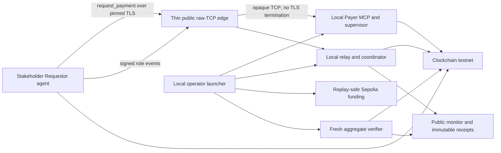

# Hybrid local-authoritative stakeholder demo design

**Status:** Approved direction

**Date:** 2026-08-02

**Repository:** `thetangstr/clockchain-handshake`

## 1. Decision

Move the stakeholder demo off the AWS control plane's critical path. Yang and
Codex run the Payer and operator authority on the Mac Studio. A stakeholder
runs one fresh Requestor agent on a separate macOS, Windows, or Linux machine.

The demo retains a thin public edge for raw TCP forwarding, signed Requestor
discovery, sanitized live monitoring, immutable public receipts, and verified
receipt email. AWS ECS, EFS, NLB, SQS, DynamoDB control state, Cognito, and
CloudFormation no longer decide whether the Handshake can run.

The existing AWS control plane remains preserved as deferred hardening. It is
not deleted, presented as complete, or used as the fallback authority.

## 2. Why the architecture changes

The last ten root-cause defects were dominated by hosted integration:

1. the SSH account was locked even when the approved key matched;
2. EFS and the tunnel account disagreed on UID/GID ownership;
3. the Payer used a different SSH username than `sshd` allowed;
4. tunnel process startup did not prove reverse-forward readiness;
5. the public Payer MCP listener was unreachable through the NLB path;
6. the opened Payer package expected the wrong manifest schema;
7. the coordinator exited before the stakeholder window ended;
8. operator control depended on stale JWT/browser/monitor state;
9. Payer approval polling did not tolerate normal transport gaps; and
10. bootstrap approval expired before human and Fargate processing completed.

Seven were direct AWS hosting, networking, authentication, or orchestration
defects. Two were participant/operator problems created by the hosted path.
One was bootstrap-schema validation. None was a failure of the core ordered
Clockchain transitions or the fresh aggregate verifier.

The prior bounded dual-track design required a pivot after more than one AWS
integration defect. That threshold has been exceeded.

## 3. Demo claim and non-negotiable proof

The simplified hosting must not simplify the proof. A successful run still
requires all of the following:

1. Requestor calls the real Payer-owned MCP and receives exact
   `HANDSHAKE_REQUIRED` guidance derived from Payer's signed mandate.
2. Payer alone owns `PROPOSED` and `ACKNOWLEDGED`.
3. Requestor alone owns `ACCEPTED`.
4. Clockchain contains exactly three independently re-verifiable anchors in
   exact `PROPOSED -> ACCEPTED -> ACKNOWLEDGED` order.
5. A newly launched aggregate verifier independently refetches the anchors and
   is the only component allowed to emit `AUTHORIZED`.
6. Every protocol, console, monitor, receipt, email, and verdict artifact
   preserves `paymentMoved:false`.
7. Missing, duplicate, reordered, expired, malformed, replayed, or mismatched
   evidence fails closed.

A mocked Payer MCP response, replayed historical receipt, locally authored
authorization verdict, or fabricated public monitor does not satisfy the demo.

## 4. Runtime architecture



### 4.1 Local authoritative processes

The Mac Studio runs existing repository-native processes:

- `bilateral:relay` for authenticated role coordination;
- `bilateral:coordinator` for exact state sequencing and launch material;
- `bilateral:console` for a local read-only projection;
- `bilateral:bootstrap-broker` for Requestor bootstrap material;
- the real Payer supervisor and Payer MCP on loopback;
- `bilateral:fund` for one journaled four-address Sepolia funding batch;
- the existing fresh aggregate verifier path; and
- `bilateral:public-monitor` for sanitized public projection.

One new local operator launcher composes these existing commands. It does not
reimplement their protocol, validation, funding, or verdict logic.

### 4.2 Thin public edge

The existing stable relay VM is reduced to a standard raw-TCP forwarding edge.
It provides only the fixed public coordination and Payer MCP listeners. The
Mac Studio opens outbound reverse SSH forwards to those listeners. The edge:

- never terminates Payer MCP or coordination TLS;
- permits no interactive shell, agent forwarding, arbitrary remote listen
  port, or alternate destination;
- has no role token, launch manifest, invitation, TLS private key, evidence,
  funding key, or verifier authority; and
- can disappear without changing historical receipts or the authorization
  rules.

The approved edge key is restricted to the fixed coordination and MCP listen
ports. A health probe must prove both forwards before Requestor discovery is
published.

### 4.3 Public projection and email

Static public infrastructure remains peripheral:

- signed Requestor discovery and the Payer public certificate;
- `latest.json` for live business progress;
- immutable `runs/{runId}.json` verified summaries;
- `runs/index.json` history; and
- the existing opt-in receipt email endpoint.

The local publisher reads only the sanitized local console and verified public
summary inputs. Publication failure may make the public view unavailable, but
it cannot create, reorder, or authorize role evidence. A completed demo is not
claimed until public history and the requested emails are independently
observed.

## 5. One-command operator experience

The operator runs one new command with one mode-`0600` local configuration
file and a fresh state root:

```sh
npm run bilateral:local-operator -- \
  --config .context/hybrid-demo/operator.json \
  --state /absolute/private/path/that/does-not-exist
```

The configuration contains paths and public endpoint metadata, not embedded
private key, token, keystore, password, capability, invitation, RPC URL, or
live evidence values. The launcher validates permissions without printing
contents.

The launcher then:

1. verifies the clean detached release and Node.js 22;
2. creates isolated operator and Payer state;
3. starts relay, coordinator, console, and bootstrap broker in exact order;
4. starts the two restricted outbound public forwards;
5. starts the local Payer and waits for exact `PAYER_MCP_READY`;
6. publishes signed Requestor discovery only after public-edge TLS probes pass;
7. emits one secret-free Requestor handoff containing the reviewed SHA,
   discovery URL, Payer MCP URL, and monitor URL;
8. executes one exact replay-safe funding batch when the signed four-address
   record is ready and the operator selected the bounded `fund-on-ready`
   policy at startup;
9. remains attached through `PROPOSED`, `ACCEPTED`, and `ACKNOWLEDGED`;
10. launches a new aggregate-verifier process; and
11. publishes immutable receipts and the opt-in email action.

The launcher may narrate business progress. It may not emit `AUTHORIZED`,
author role events, substitute monitor state for evidence, or retry an
ambiguous funding batch.

## 6. Stakeholder Requestor experience

The stakeholder receives one prompt from the public run page. The prompt tells
their local Codex, Claude Code, or Hermes agent to:

1. clone the public repository into a blank folder;
2. detach at the exact reviewed release SHA;
3. confirm Node.js 22 and run `npm ci --ignore-scripts`;
4. create a fresh private Requestor state child that does not yet exist; and
5. run the existing one-shot `bilateral:request-payment` wrapper with the
   signed public Requestor discovery URL.

The wrapper—not the human—calls Payer MCP, requires exact
`HANDSHAKE_REQUIRED`, validates the signed mandate guidance, starts the
Requestor supervisor, and remains attached until Requestor reaches `ACCEPTED`.

No attachment, launch manifest, invitation, token, capability, private path,
or AWS credential is sent to the stakeholder.

## 7. Funding and replay safety

The local launcher may invoke funding automatically only when all of these are
true:

- startup explicitly selected `fund-on-ready`;
- the coordinator produced a valid signed record for exactly four fresh
  addresses;
- each amount is exactly `0.01 Sepolia ETH`;
- the treasury address matches the configured public metadata;
- the replay journal contains no submitted or ambiguous attempt for the
  record; and
- the current treasury balance and nonce are sufficient and unambiguous.

Any uncertainty stops the run. The launcher never reconstructs, deletes, or
overwrites a funding journal and never resends an ambiguous batch.

## 8. Public run page

The production `/handshake/run` page becomes Requestor-first from the
stakeholder's perspective:

1. a short statement that Yang/Codex is operating the local Payer and operator;
2. one prominent Requestor starter prompt with a copy icon;
3. an explicit `PAYER_MCP_READY` readiness indicator;
4. the live Clockchain monitor;
5. completed receipt cards and immutable history; and
6. opt-in email for verified HTML receipts.

The page removes the stakeholder Payer prompt from the primary procedure. It
labels the full AWS stakeholder-Payer architecture as deferred hardening, not
as the live path.

## 9. Failure handling

The launcher stops all children and publishes a fixed secret-free failure when:

- a local child exits unexpectedly;
- either reverse forward is missing, changed, or bound to the wrong port;
- discovery is stale, unsigned, malformed, or release/session mismatched;
- Payer MCP is reachable before readiness or unavailable after readiness;
- Requestor does not receive exact `HANDSHAKE_REQUIRED`;
- a funding record or journal is missing, duplicated, ambiguous, or changed;
- any role event is missing, duplicated, reordered, expired, malformed, or
  signed by the wrong role;
- the anchor count is not exactly three; or
- fresh verifier evidence is missing or cannot be independently reproduced.

Failure never deletes prior immutable history and never converts local role
completion into authorization.

## 10. Verification policy

Use focused tests while building the hybrid glue:

- local public-edge validation and health probes;
- local operator child ordering, cleanup, and secret redaction;
- funding replay adoption and ambiguity rejection;
- signed Requestor discovery and Payer MCP intake;
- terminal public history and receipt email; and
- one deterministic local multiprocess happy path.

Then run one fresh Hermes Requestor acceptance cycle against the real public
edge. Only after the live cycle succeeds should the broad negative matrix and
one final `npm run verify` run.

## 11. Acceptance criteria

The hybrid demo is complete only when one fresh stakeholder run proves:

- the operator starts the local authority with one command;
- the public edge passes coordination and Payer MCP health probes;
- a separate Hermes `handshake_requester` profile uses only the public prompt;
- Requestor receives exact `HANDSHAKE_REQUIRED` from the real Payer MCP;
- one replay-safe four-address Sepolia funding batch completes;
- Clockchain records exactly `PROPOSED -> ACCEPTED -> ACKNOWLEDGED`;
- exactly three public explorer links and receipt cards are visible;
- a new aggregate verifier alone emits `AUTHORIZED`;
- `paymentMoved:false` is visible everywhere;
- immutable public history remains available after local processes stop;
- verified HTML receipts reach both opted-in email addresses; and
- malformed, reordered, duplicate, stale, and mismatched evidence checks fail
  closed.

## 12. Deferred work

- stakeholder-operated Payer bootstrap through the AWS control plane;
- AWS ECS/EFS/NLB tunnel hardening and high availability;
- concurrent active demo sessions;
- automatic public-edge provisioning and certificate renewal;
- production settlement or mainnet value transfer;
- multi-validator security claims; and
- browser-only stakeholder agents.
